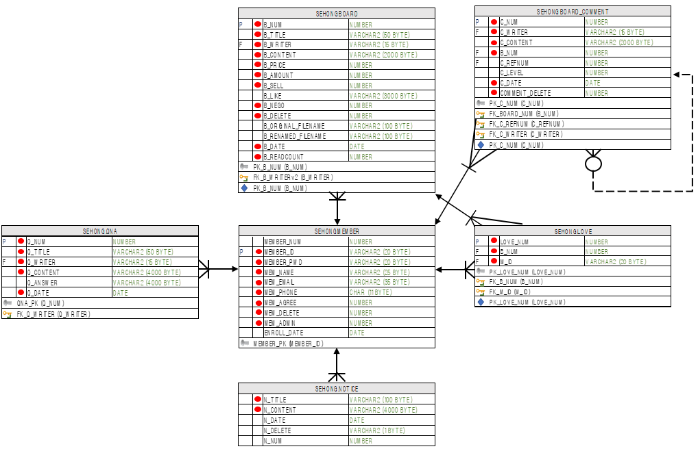
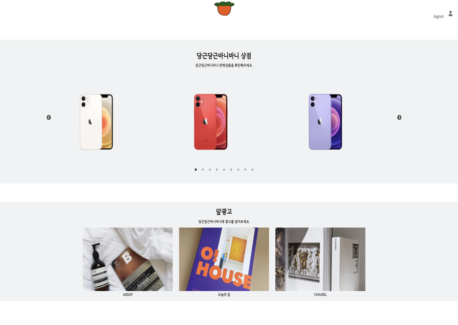
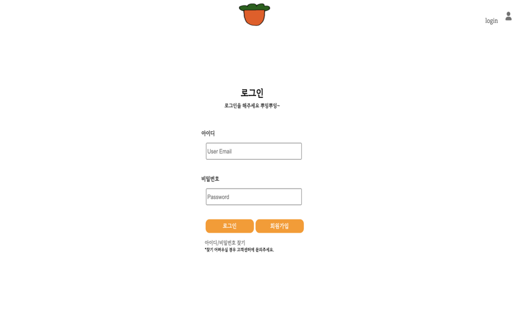
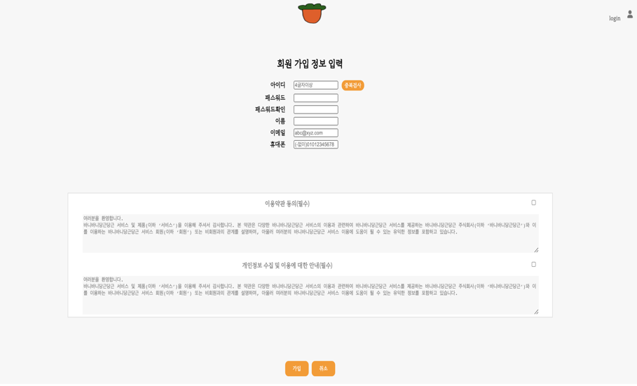
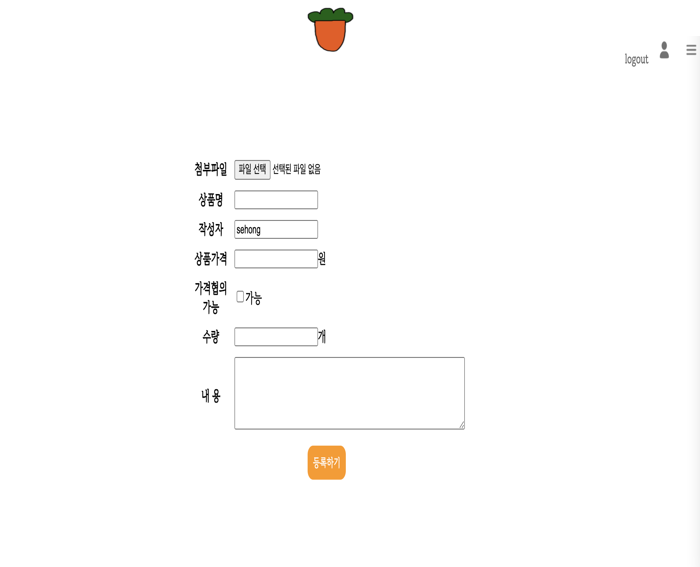

# 당근당근 바니바니
누구나 숨 쉬듯 거래하는 귀여운 세상을 만들다

---
### 📚 프로젝트 개요

마치 숨을 쉴 때 의식하지 않는 것처럼 '어떤 불편도 느끼지 않도록 하는 중고거래 사이트를 만들자' 라는 컨셉

✏️ 목적

- 요즘 많이 쓰이는 Spring 프레임 워크를 사용하지 않고 첫 웹 사이트를 만들어보자는 뜻이 있습니다.

💡 목표

1. JDBC 이해 및 적용: [정리글](https://blog.naver.com/harrison1995/222388382270)
2. WAS 아키텍처 파악: [정리글](https://blog.naver.com/harrison1995/222390208208)
3. MVC pattern 적용하기: [정리글](https://blog.naver.com/harrison1995/222391331779)
4. Servlet의 Life Cycle 이해하기: [정리글](https://blog.naver.com/harrison1995/222393259701)
5. 어렵지만 JSP 잘 활용하기: [정리글](https://blog.naver.com/harrison1995/222398327870)

---
### 💻 개발환경

- 운영체제: Mac os / Windows

- 개발도구: Eclipse

- 협업도구: GitHub

- 사용언어
    - HTML/CSS/JS
    - JSP/jQuery
    - Java
    - SQL

- 서버: Apache Tomcat(Servlet)

- DB: Oracle DB

---
### 📖 ERD 설계

---
### 📺 구현 화면
- Home

- Login

- SignUp

- Sell

- Post

- 이외 게시판, 마이 페이지 등등도 있으나 생략
